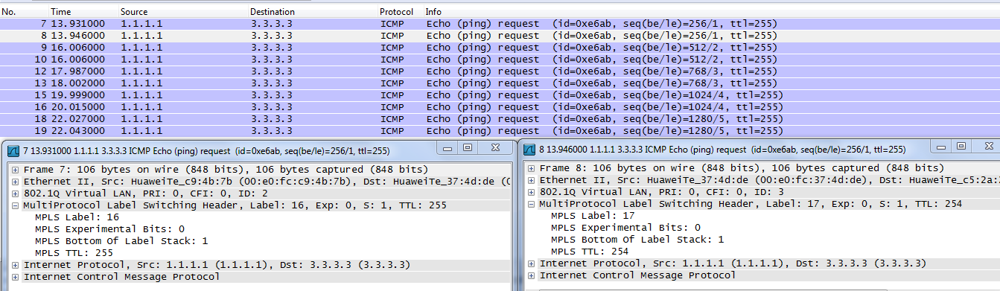
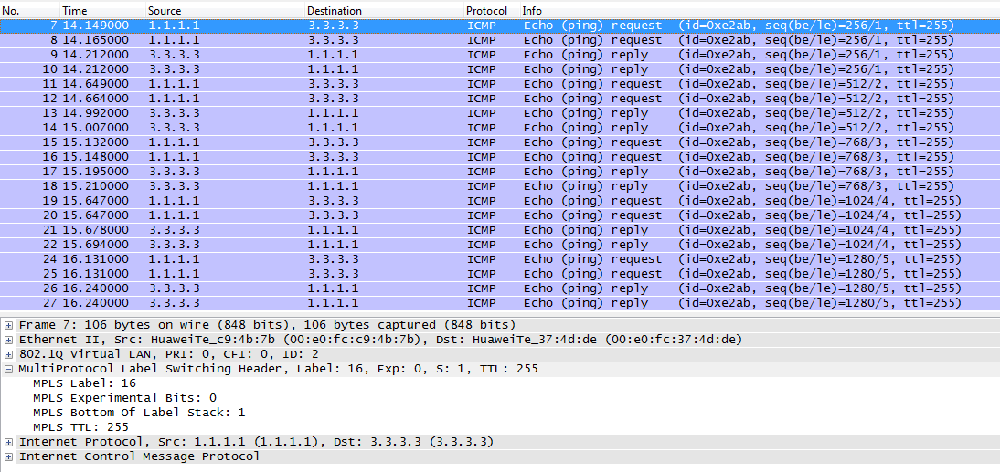

# Ejercicio MPLS - LSPs Estáticos
## Topología


RA y RB tienen una conexión point-to-point

RB y RC tienen una conexión point-to-point

La interfaz GE0/0/0 está particionada en:
- .0 conectado a RA
- .1 conectado a RC

### Preconfiguración y Generación del LSP Left2Roght
#### Switch
```
// Creo VLANs
<Huawei>system-view
[Huawei]sysname Switch
[Switch]vlan 1
[Switch-vlan1]vlan 2
[Switch-vlan2]vlan 3
[Switch-vlan3]quit

// Configuro interfaz para ser el sumidero de paquetes copiados
[Switch]observe-port 1 interface GigabitEthernet 0/0/4

// Configuro resto de las interfaces
[Switch]interface GigabitEthernet0/0/1
[Switch-GigabitEthernet0/0/1]port link-type access
[Switch-GigabitEthernet0/0/1]port default vlan 2
[Switch-GigabitEthernet0/0/1]port-mirroring to observe-port 1 inbound
[Switch-GigabitEthernet0/0/1]quit

[Switch]interface GigabitEthernet 0/0/2
[Switch-GigabitEthernet0/0/2]port link-type trunk
[Switch-GigabitEthernet0/0/2]port trunk allow-pass vlan 2 3
[Switch-GigabitEthernet0/0/2]port-mirroring to observe-port 1 inbound
[Switch-GigabitEthernet0/0/2]quit

[Switch]interface GigabitEthernet 0/0/3
[Switch-GigabitEthernet0/0/3]port link-type access
[Switch-GigabitEthernet0/0/3]port default vlan 3
[Switch-GigabitEthernet0/0/3]port-mirroring to observe-port 1 inbound

[Switch]display port vlan active
T=TAG U=UNTAG
-------------------------------------------------------------------------------
Port                Link Type    PVID    VLAN List
-------------------------------------------------------------------------------
GE0/0/1             access       2       U: 2
GE0/0/2             trunk        1       U: 1
                                         T: 2 to 3
GE0/0/3             access       3       U: 3

>>>>>>>>>>>>>>>>>>>>>>>>>>>>>>>>>>>>>>>>>>>>>>>>>>>>>>>>>>>>>>>>>>>>>>>>>>>>>>>>

<Switch>display vlan
The total number of vlans is : 3
--------------------------------------------------------------------------------
U: Up;         D: Down;         TG: Tagged;         UT: Untagged;
MP: Vlan-mapping;               ST: Vlan-stacking;
#: ProtocolTransparent-vlan;    *: Management-vlan;
--------------------------------------------------------------------------------

VID  Type    Ports                                                          
--------------------------------------------------------------------------------
1    common  UT:GE0/0/2(D)      GE0/0/4(U)      GE0/0/5(D)      GE0/0/6(D)      
                GE0/0/7(D)      GE0/0/8(D)      GE0/0/9(D)      GE0/0/10(D)     
                GE0/0/11(D)     GE0/0/12(D)     GE0/0/13(D)     GE0/0/14(D)     
                GE0/0/15(D)     GE0/0/16(D)     GE0/0/17(D)     GE0/0/18(D)     
                GE0/0/19(D)     GE0/0/20(D)     GE0/0/21(D)     GE0/0/22(D)     

                GE0/0/23(D)     GE0/0/24(D)                                     

2    common  UT:GE0/0/1(U)                                                      

             TG:GE0/0/2(D)                                                      

3    common  UT:GE0/0/3(D)                                                      

             TG:GE0/0/2(D)                                                      


VID  Status  Property      MAC-LRN Statistics Description      
--------------------------------------------------------------------------------

1    enable  default       enable  disable    VLAN 0001                         
2    enable  default       enable  disable    VLAN 0002                         
3    enable  default       enable  disable    VLAN 0003
```

#### Router A
```
<Huawei>system-view
[Huawei]sysname RouterA

[RouterA]mpls lsr-id 1.1.1.1
[RouterA]mpls
[RouterA]static-lsp ingress left2right destination 3.3.3.3 32 nexthop 10.1.1.2 out-label 16
[RouterA]ip route-static 3.3.3.3 32 10.1.1.2

[RouterA]interface LoopBack 0
[RouterA-LoopBack0]ip address 1.1.1.1 255.255.255.255
[RouterA-LoopBack0]quit

[RouterA]interface GigabitEthernet 0/0/0
[RouterA-GigabitEthernet0/0/0]ip address 10.1.1.1 30
[RouterA-GigabitEthernet0/0/0]mpls
[RouterA-GigabitEthernet0/0/0]quit

<RouterA>display ip routing-table
Route Flags: R - relay, D - download to fib
------------------------------------------------------------------------------
Routing Tables: Public
         Destinations : 8        Routes : 8        

Destination/Mask    Proto   Pre  Cost      Flags NextHop         Interface

        1.1.1.1/32  Direct  0    0           D   127.0.0.1       LoopBack0
       10.1.1.0/30  Direct  0    0           D   10.1.1.1        GigabitEthernet 0/0/0
       10.1.1.1/32  Direct  0    0           D   127.0.0.1       GigabitEthernet 0/0/0
       10.1.1.3/32  Direct  0    0           D   127.0.0.1       GigabitEthernet 0/0/0
      127.0.0.0/8   Direct  0    0           D   127.0.0.1       InLoopBack0
      127.0.0.1/32  Direct  0    0           D   127.0.0.1       InLoopBack0
127.255.255.255/32  Direct  0    0           D   127.0.0.1       InLoopBack0
255.255.255.255/32  Direct  0    0           D   127.0.0.1       InLoopBack0


[RouterA]display mpls static-lsp
TOTAL          :	1       STATIC LSP(S)
UP             :	1       STATIC LSP(S)
DOWN           :	0       STATIC LSP(S)
Name                FEC                I/O Label    I/O If                Status
left2right          3.3.3.3/32         NULL/16      -/GE0/0/0             Up
```
#### Router B
Como se trabaja primero con subinterfaces, es necesario crearlas antes de utilizarlas en MPLS
```
<Huawei>system-view
[Huawei]sysname RouterB

[RouterB]mpls lsr-id 2.2.2.2
[RouterB]mpls

[RouterB]interface GigabitEthernet 0/0/0.1
[RouterB-GigabitEthernet0/0/0.1]ip address 10.1.1.2 30
[RouterB-GigabitEthernet0/0/0.1]dot1q termination vid 2
[RouterB-GigabitEthernet0/0/0.1]mpls
[RouterB-GigabitEthernet0/0/0.1]quit
[RouterB]static-lsp transit left2right incoming-interface GigabitEthernet 0/0/0.1 in-label 16 nexthop 10.1.2.2 out-label 17

[RouterB]interface GigabitEthernet 0/0/0.2
[RouterB-GigabitEthernet0/0/0.2]ip address 10.1.2.1 30
[RouterB-GigabitEthernet0/0/0.2]dot1q termination vid 3
[RouterB-GigabitEthernet0/0/0.2]mpls
[RouterB-GigabitEthernet0/0/0.2]quit

[RouterB]interface LoopBack 0
[RouterB-LoopBack0]ip addres 2.2.2.2 32
[RouterB-LoopBack0]quit

<RouterB>display ip routing-table
Route Flags: R - relay, D - download to fib
------------------------------------------------------------------------------
Routing Tables: Public
         Destinations : 11       Routes : 11       

Destination/Mask    Proto   Pre  Cost      Flags NextHop         Interface

        2.2.2.2/32  Direct  0    0           D   127.0.0.1       LoopBack0
       10.1.1.0/30  Direct  0    0           D   10.1.1.2        GigabitEthernet 0/0/0.1
       10.1.1.2/32  Direct  0    0           D   127.0.0.1       GigabitEthernet 0/0/0.1
       10.1.1.3/32  Direct  0    0           D   127.0.0.1       GigabitEthernet 0/0/0.1
       10.1.2.0/30  Direct  0    0           D   10.1.2.1        GigabitEthernet 0/0/0.2
       10.1.2.1/32  Direct  0    0           D   127.0.0.1       GigabitEthernet 0/0/0.2
       10.1.2.3/32  Direct  0    0           D   127.0.0.1       GigabitEthernet 0/0/0.2
      127.0.0.0/8   Direct  0    0           D   127.0.0.1       InLoopBack0
      127.0.0.1/32  Direct  0    0           D   127.0.0.1       InLoopBack0
127.255.255.255/32  Direct  0    0           D   127.0.0.1       InLoopBack0
255.255.255.255/32  Direct  0    0           D   127.0.0.1       InLoopBack0

<RouterB>display mpls static-lsp
TOTAL          :	1       STATIC LSP(S)
UP             :	1       STATIC LSP(S)
DOWN           :	0       STATIC LSP(S)
Name                FEC                I/O Label    I/O If                Status

left2right          -/-                16/17        GE0/0/0.1/GE0/0/0.2   Up    

```
#### Router C
```
<Huawei>system-view
[Huawei]sysname RouterC

[RouterC]mpls lsr-id 3.3.3.3
[RouterC]mpls
[RouterC]static-lsp egress left2right incoming-interface GigabitEthernet 0/0/0 in-label 17

[RouterC]interface LoopBack 0
[RouterC-LoopBack0]ip address 3.3.3.3 32
[RouterC-LoopBack0]quit

[RouterC]interface GigabitEthernet 0/0/0
[RouterC-GigabitEthernet0/0/0]ip address 10.1.2.2 30
[RouterC-GigabitEthernet0/0/0]mpls
[RouterC-GigabitEthernet0/0/0]quit

<RouterC>display ip routing-table
Route Flags: R - relay, D - download to fib
------------------------------------------------------------------------------
Routing Tables: Public
         Destinations : 8        Routes : 8        

Destination/Mask    Proto   Pre  Cost      Flags NextHop         Interface

        3.3.3.3/32  Direct  0    0           D   127.0.0.1       LoopBack0
       10.1.2.0/30  Direct  0    0           D   10.1.2.2        GigabitEthernet 0/0/0
       10.1.2.2/32  Direct  0    0           D   127.0.0.1       GigabitEthernet 0/0/0
       10.1.2.3/32  Direct  0    0           D   127.0.0.1       GigabitEthernet 0/0/0
      127.0.0.0/8   Direct  0    0           D   127.0.0.1       InLoopBack0
      127.0.0.1/32  Direct  0    0           D   127.0.0.1       InLoopBack0
127.255.255.255/32  Direct  0    0           D   127.0.0.1       InLoopBack0
255.255.255.255/32  Direct  0    0           D   127.0.0.1       InLoopBack0

<RouterC>display mpls lsp
-------------------------------------------------------------------------------
                 LSP Information: STATIC LSP
-------------------------------------------------------------------------------
FEC                In/Out Label  In/Out IF                      Vrf Name       
-/-                17/NULL       GE0/0/0/-                                     
```
### Ping Router A a Router C
No tendría que funcionar porque el LSP es unidireccional, falta el camino de vuelta.
#### Ping enviado por Router A
```
<RouterA>ping 3.3.3.3
  PING 3.3.3.3: 56  data bytes, press CTRL_C to break
    Request time out
    Request time out
    Request time out
    Request time out
    Request time out

  --- 3.3.3.3 ping statistics ---
    5 packet(s) transmitted
    0 packet(s) received
    100.00% packet loss
```
#### Paquetes capturados con Wireshark en Router B


### Generación LSP Right2Left
#### Router A
```
<RouterA>system-view
[RouterA]static-lsp egress right2left incoming-interface GigabitEthernet 0/0/0 in-label 16

[RouterA]display mpls static-lsp
TOTAL          :	2       STATIC LSP(S)
UP             :	2       STATIC LSP(S)
DOWN           :	0       STATIC LSP(S)
Name                FEC                I/O Label    I/O If                Status

left2right          3.3.3.3/32         NULL/16      -/GE0/0/0             Up

right2left          -/-                16/NULL      GE0/0/0/-             Up

[RouterA]quit
<RouterA>save  
```
#### Router B
```
<RouterB>system-view
[RouterB]static-lsp transit right2left incoming-interface GigabitEthernet 0/0/0.2 in-label 17 nexthop 10.1.1.1 out-label 16

[RouterB]display mpls static-lsp
TOTAL          :	2       STATIC LSP(S)
UP             :	2       STATIC LSP(S)
DOWN           :	0       STATIC LSP(S)
Name                FEC                I/O Label    I/O If                Status

left2right          -/-                16/17        GE0/0/0.1/GE0/0/0.2   Up

right2left          -/-                17/16        GE0/0/0.2/GE0/0/0.1   Up

[RouterB]quit
<RouterB>save
```
#### Router C
```
<RouterC>system-view
[RouterC]static-lsp ingress right2left destination 1.1.1.1 32 nexthop 10.1.2.1 out-label 17
[RouterC]ip route-static 1.1.1.1 32 10.1.2.1

[RouterC]display mpls static-lsp
TOTAL          :	2       STATIC LSP(S)
UP             :	2       STATIC LSP(S)
DOWN           :	0       STATIC LSP(S)
Name                FEC                I/O Label    I/O If                Status

left2right          -/-                17/NULL      GE0/0/0/-             Up  

right2left          1.1.1.1/32         NULL/17      -/GE0/0/0             Up  
[RouterC]quit
<RouterC>save
```

### Ping Router A a Router C con 2 LSPs
Es necesario que el Router A mande el paquete con la dirección de fuente 1.1.1.1 ya que el Router C solo lo conoce con esa dirección
#### Ping enviado por Router A
```
<RouterA>ping -a 1.1.1.1 3.3.3.3
  PING 3.3.3.3: 56  data bytes, press CTRL_C to break
    Reply from 3.3.3.3: bytes=56 Sequence=1 ttl=254 time=280 ms
    Reply from 3.3.3.3: bytes=56 Sequence=2 ttl=254 time=210 ms
    Reply from 3.3.3.3: bytes=56 Sequence=3 ttl=254 time=110 ms
    Reply from 3.3.3.3: bytes=56 Sequence=4 ttl=254 time=360 ms
    Reply from 3.3.3.3: bytes=56 Sequence=5 ttl=254 time=140 ms

  --- 3.3.3.3 ping statistics ---
    5 packet(s) transmitted
    5 packet(s) received
    0.00% packet loss
    round-trip min/avg/max = 110/220/360 ms
```

#### Paquetes capturados con Wireshark en Router B

