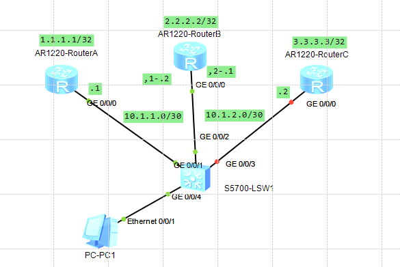
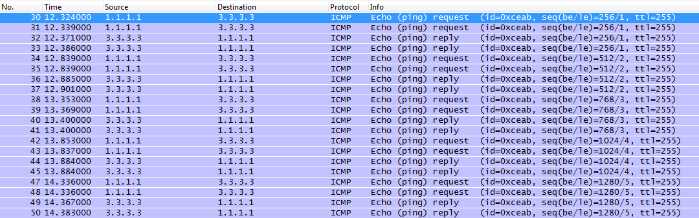
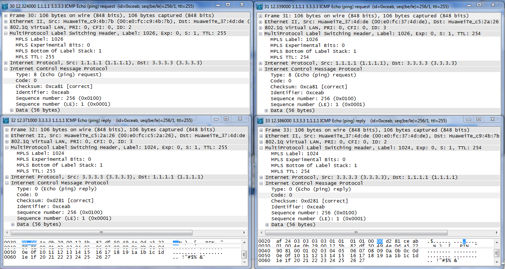

# Ejercicio MPLS - LDP y OSPF
Partiendo de la configuración del ejercicio anterior, se borra la configuración de MPLS y los enrutamientos estáticos en los routers, Luego se configuran para que trabajen con LDP y OSPF. También se desactiva Penultimate Hop Popping (PHP).

## Topología


RA y RB tienen una conexión point-to-point

RB y RC tienen una conexión point-to-point

La interfaz GE0/0/0 está particionada en:
- .0 conectado a RA
- .1 conectado a RC


### Configuración
#### Router A
```
<RouterA>system-view
[RouterA]undo mpls
[RouterA]undo ip route-static 3.3.3.3 32

[RouterA]ospf 100
[RouterA-ospf-100-area-0.0.0.0]network 1.1.1.1 0.0.0.0
[RouterA-ospf-100-area-0.0.0.0]network 10.1.1.0 0.0.0.3

[RouterA]mpls
[RouterA-mpls]label advertise non-null
[RouterA-mpls]mpls ldp
[RouterA-mpls-ldp]interface GigabitEthernet 0/0/0
[RouterA-GigabitEthernet0/0/0]mpls
[RouterA-GigabitEthernet0/0/0]mpls ldp

<RouterA>save

```
#### Router B
```
<RouterB>system-view
[RouterB]undo mpls
[RouterB]ospf 100
[RouterB-ospf-100]area 0
[RouterB-ospf-100-area-0.0.0.0]network 2.2.2.2 0.0.0.0
[RouterB-ospf-100-area-0.0.0.0]network 10.1.1.0 0.0.0.3
[RouterB-ospf-100-area-0.0.0.0]network 10.1.2.0 0.0.0.3

[RouterB]mpls
[RouterB-mpls]label advertise non-null
[RouterB-mpls]mpls ldp
[RouterB-mpls-ldp]interface GigabitEthernet 0/0/0.1
[RouterB-GigabitEthernet0/0/0.1]mpls
[RouterB-GigabitEthernet0/0/0.1]mpls ldp

[RouterB]interface GigabitEthernet 0/0/0.2
[RouterB-GigabitEthernet0/0/0.2]mpls
[RouterB-GigabitEthernet0/0/0.2]mpls ldp

<RouterB>save
```
#### Router C
```
<RouterC>system-view
Enter system view, return user view with Ctrl+Z.
[RouterC]undo mpls
[RouterC]undo ip route-static 1.1.1.1 32

[RouterC]ospf 100
[RouterC-ospf-100]area 0
[RouterC-ospf-100-area-0.0.0.0]network 3.3.3.3 0.0.0.0
[RouterC-ospf-100-area-0.0.0.0]network 10.1.2.0 0.0.0.3

[RouterC]mpls
[RouterA-mpls]label advertise non-null
[RouterC-mpls]mpls ldp
[RouterC-mpls-ldp]interface GigabitEthernet 0/0/0
[RouterC-GigabitEthernet0/0/0]mpls
[RouterC-GigabitEthernet0/0/0]mpls ldp
```
### Tablas OSPF y LSPs
#### Router A
```
<RouterA>display ospf routing

	 OSPF Process 100 with Router ID 10.1.1.1
		  Routing Tables

 Routing for Network
 Destination        Cost  Type       NextHop         AdvRouter       Area
 1.1.1.1/32         0     Stub       1.1.1.1         10.1.1.1        0.0.0.0
 10.1.1.0/30        1     Transit    10.1.1.1        10.1.1.1        0.0.0.0
 2.2.2.2/32         1     Stub       10.1.1.2        2.2.2.2         0.0.0.0
 3.3.3.3/32         2     Stub       10.1.1.2        10.1.2.2        0.0.0.0
 10.1.2.0/30        2     Transit    10.1.1.2        10.1.2.2        0.0.0.0

 Total Nets: 5  
 Intra Area: 5  Inter Area: 0  ASE: 0  NSSA: 0

<RouterA>display mpls lsp
-------------------------------------------------------------------------------
                 LSP Information: LDP LSP
-------------------------------------------------------------------------------
FEC                In/Out Label  In/Out IF                      Vrf Name       
1.1.1.1/32         1024/NULL     -/-                                           
2.2.2.2/32         NULL/1025     -/GE0/0/0                                     
2.2.2.2/32         1025/1025     -/GE0/0/0                                     
3.3.3.3/32         NULL/1026     -/GE0/0/0                                     
3.3.3.3/32         1026/1026     -/GE0/0/0

<RouterA>display mpls route-state
Codes: B(BGP), I(IGP), L(Public Label BGP), O(Original BGP), U(Unknow)
--------------------------------------------------------------------------------
Dest/Mask          Next-Hop        Out-Interface              State LSP VRF Type
--------------------------------------------------------------------------------

1.1.1.1/32         127.0.0.1       InLoop0                    READY 1   0      I

2.2.2.2/32         10.1.1.2        GE0/0/0                    READY 2   0      I

3.3.3.3/32         10.1.1.2        GE0/0/0                    READY 2   0      I
```
#### Router B
```
<RouterB>display ospf routing

	 OSPF Process 100 with Router ID 2.2.2.2
		  Routing Tables

 Routing for Network
 Destination        Cost  Type       NextHop         AdvRouter       Area
 2.2.2.2/32         0     Stub       2.2.2.2         2.2.2.2         0.0.0.0
 10.1.1.0/30        1     Transit    10.1.1.2        2.2.2.2         0.0.0.0
 10.1.2.0/30        1     Transit    10.1.2.1        2.2.2.2         0.0.0.0
 1.1.1.1/32         1     Stub       10.1.1.1        10.1.1.1        0.0.0.0
 3.3.3.3/32         1     Stub       10.1.2.2        10.1.2.2        0.0.0.0

 Total Nets: 5  
 Intra Area: 5  Inter Area: 0  ASE: 0  NSSA: 0

<RouterB>display mpls lsp
-------------------------------------------------------------------------------
                 LSP Information: LDP LSP
-------------------------------------------------------------------------------
FEC                In/Out Label  In/Out IF                      Vrf Name       
1.1.1.1/32         NULL/1024     -/GE0/0/0.1                                   
1.1.1.1/32         1024/1024     -/GE0/0/0.1                                   
2.2.2.2/32         1025/NULL     -/-                                           
3.3.3.3/32         NULL/1026     -/GE0/0/0.2                                   
3.3.3.3/32         1026/1026     -/GE0/0/0.2

<RouterB>display mpls route-state
Codes: B(BGP), I(IGP), L(Public Label BGP), O(Original BGP), U(Unknow)
--------------------------------------------------------------------------------
Dest/Mask          Next-Hop        Out-Interface              State LSP VRF Type
--------------------------------------------------------------------------------

1.1.1.1/32         10.1.1.1        GE0/0/0.1                  READY 2   0      I
2.2.2.2/32         127.0.0.1       InLoop0                    READY 1   0      I
3.3.3.3/32         10.1.2.2        GE0/0/0.2                  READY 2   0      I
```
#### Router C
```
<RouterC>display ospf routing

	 OSPF Process 100 with Router ID 10.1.2.2
		  Routing Tables

 Routing for Network
 Destination        Cost  Type       NextHop         AdvRouter       Area
 3.3.3.3/32         0     Stub       3.3.3.3         10.1.2.2        0.0.0.0
 10.1.2.0/30        1     Transit    10.1.2.2        10.1.2.2        0.0.0.0
 1.1.1.1/32         2     Stub       10.1.2.1        10.1.1.1        0.0.0.0
 2.2.2.2/32         1     Stub       10.1.2.1        2.2.2.2         0.0.0.0
 10.1.1.0/30        2     Transit    10.1.2.1        10.1.1.1        0.0.0.0

 Total Nets: 5  
 Intra Area: 5  Inter Area: 0  ASE: 0  NSSA: 0

<RouterC>display mpls lsp
-------------------------------------------------------------------------------
                 LSP Information: LDP LSP
-------------------------------------------------------------------------------
FEC                In/Out Label  In/Out IF                      Vrf Name       
1.1.1.1/32         NULL/1024     -/GE0/0/0                                     
1.1.1.1/32         1024/1024     -/GE0/0/0                                     
2.2.2.2/32         NULL/1025     -/GE0/0/0                                     
2.2.2.2/32         1025/1025     -/GE0/0/0                                     
3.3.3.3/32         1026/NULL     -/-      

<RouterB>display mpls route-state
Codes: B(BGP), I(IGP), L(Public Label BGP), O(Original BGP), U(Unknow)
--------------------------------------------------------------------------------
Dest/Mask          Next-Hop        Out-Interface              State LSP VRF Type
--------------------------------------------------------------------------------

1.1.1.1/32         10.1.1.1        GE0/0/0.1                  READY 2   0      I
2.2.2.2/32         127.0.0.1       InLoop0                    READY 1   0      I
3.3.3.3/32         10.1.2.2        GE0/0/0.2                  READY 2   0      I

<RouterC>display mpls route-state
Codes: B(BGP), I(IGP), L(Public Label BGP), O(Original BGP), U(Unknow)
--------------------------------------------------------------------------------
Dest/Mask          Next-Hop        Out-Interface              State LSP VRF Type
--------------------------------------------------------------------------------

1.1.1.1/32         10.1.2.1        GE0/0/0                    READY 2   0      I

2.2.2.2/32         10.1.2.1        GE0/0/0                    READY 2   0      I

3.3.3.3/32         127.0.0.1       InLoop0                    READY 1   0      I
```
#### LSPs generados (6)
```
R1 ------------------- R2 ------------------- R3
          '1026'                 '1026'
 |-------------------------------------------->
          '1024'                 '1024'
 <--------------------------------------------|
          '1025'                 '1025'
 |---------------------><---------------------|
          '1024'                 '1026'
 <---------------------||--------------------->
```
### Ping Router A al Router C
```
<RouterA>ping -a 1.1.1.1 3.3.3.3
  PING 3.3.3.3: 56  data bytes, press CTRL_C to break
    Reply from 3.3.3.3: bytes=56 Sequence=1 ttl=254 time=100 ms
    Reply from 3.3.3.3: bytes=56 Sequence=2 ttl=254 time=100 ms
    Reply from 3.3.3.3: bytes=56 Sequence=3 ttl=254 time=110 ms
    Reply from 3.3.3.3: bytes=56 Sequence=4 ttl=254 time=90 ms
    Reply from 3.3.3.3: bytes=56 Sequence=5 ttl=254 time=90 ms

  --- 3.3.3.3 ping statistics ---
    5 packet(s) transmitted
    5 packet(s) received
    0.00% packet loss
    round-trip min/avg/max = 90/98/110 ms
```
#### Paquetes capturados con Wireshark en Router B




Los routers utilizan los dos primeros LSPs
