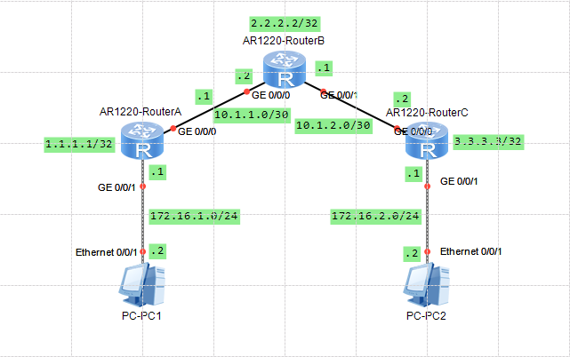
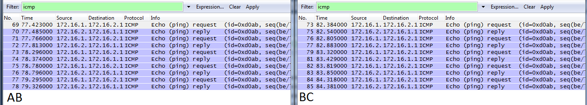
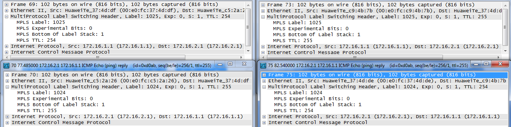
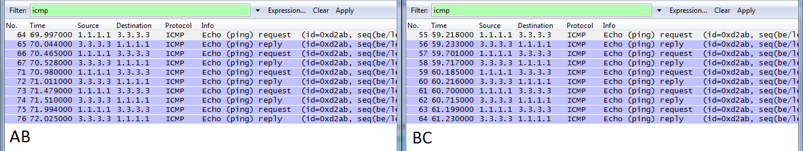
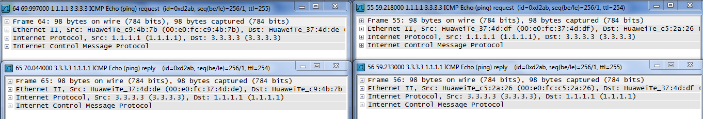
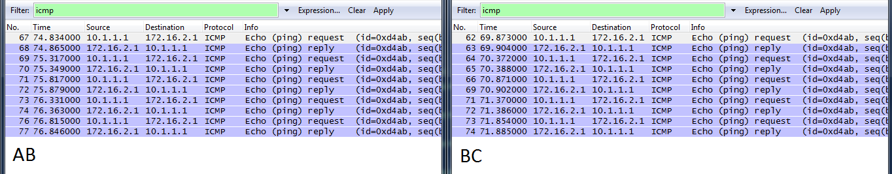
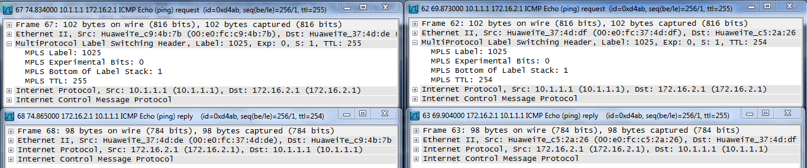
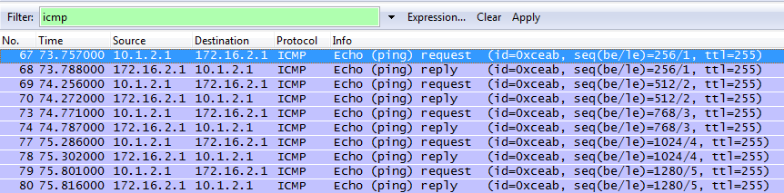
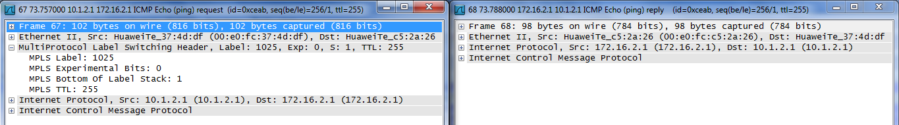

# Ejercicio MPLS - LDP y OSPF
Se prepara el sistema, creando las conexiones necesarias. Posteriormente se configura OSPF. Por último se configura MPLS.

## Topología


RA y RB tienen una conexión point-to-point

RB y RC tienen una conexión point-to-point

### Configuración
#### Router A
```
<Huawei>system-view
[Huawei]sysname RouterA

[RouterA]interface LoopBack 0
[RouterA-LoopBack0]ip address 1.1.1.1 32

[RouterA-LoopBack0]interface GigabitEthernet 0/0/0
[RouterA-GigabitEthernet0/0/0]ip address 10.1.1.1 30

[RouterA-GigabitEthernet0/0/0]interface GigabitEthernet 0/0/1
[RouterA-GigabitEthernet0/0/1]ip address 172.16.1.1 24

[RouterA]ospf 100
[RouterA-ospf-100]area 0
[RouterA-ospf-100-area-0.0.0.0]network 1.1.1.1 0.0.0.0
[RouterA-ospf-100-area-0.0.0.0]network 10.1.1.0 0.0.0.3
[RouterA-ospf-100-area-0.0.0.0]network 172.16.1.0 0.0.0.255

[RouterA]mpls lsr-id 1.1.1.1
[RouterA]mpls
[RouterA-mpls]label advertise non-null
[RouterA-mpls]lsp-trigger ip-prefix LAN
[RouterA-mpls]mpls ldp

[RouterA]ip ip-prefix LAN index 10 permit 172.16.1.0 24
[RouterA]ip ip-prefix LAN index 20 permit 172.16.2.0 24

[RouterA]interface GigabitEthernet 0/0/0
[RouterA-GigabitEthernet0/0/0]mpls
[RouterA-GigabitEthernet0/0/0]mpls ldp

<RouterA>save
```
#### Router B
```
<Huawei>system-view
[Huawei]sysname RouterB

[RouterB]interface LoopBack 0
[RouterB-LoopBack0]ip address 2.2.2.2 32

[RouterB-LoopBack0]interface GigabitEthernet 0/0/0
[RouterB-GigabitEthernet0/0/0]ip address 10.1.1.2 30

[RouterB-GigabitEthernet0/0/0]interface GigabitEthernet 0/0/1
[RouterB-GigabitEthernet0/0/1]ip address 10.1.2.1 30

[RouterB]ospf 100
[RouterB-ospf-100]area 0
[RouterB-ospf-100-area-0.0.0.0]network 2.2.2.2 0.0.0.0
[RouterB-ospf-100-area-0.0.0.0]network 10.1.1.0 0.0.0.3
[RouterB-ospf-100-area-0.0.0.0]network 10.1.2.0 0.0.0.3

[RouterB]mpls lsr-id 2.2.2.2
[RouterB]mpls
[RouterB-mpls]label advertise non-null
[RouterB-mpls]lsp-trigger ip-prefix LAN
[RouterB-mpls]mpls ldp

[RouterB]ip ip-prefix LAN index 10 permit 172.16.1.0 24
[RouterB]ip ip-prefix LAN index 20 permit 172.16.2.0 24

[RouterB]interface GigabitEthernet 0/0/0
[RouterB-GigabitEthernet0/0/0]mpls
[RouterB-GigabitEthernet0/0/0]mpls ldp

[RouterB-GigabitEthernet0/0/0]interface GigabitEthernet 0/0/1
[RouterB-GigabitEthernet0/0/1]mpls
[RouterB-GigabitEthernet0/0/1]mpls ldp

<RouterB>save
```
#### Router C
```
<Huawei>system-view
[Huawei]sysname RouterC

[RouterC]interface LoopBack 0
[RouterC-LoopBack0]ip address 3.3.3.3 32

[RouterC-LoopBack0]interface GigabitEthernet 0/0/0
[RouterC-GigabitEthernet0/0/0]ip address 10.1.2.2 30

[RouterC-GigabitEthernet0/0/0]interface GigabitEthernet 0/0/1
[RouterC-GigabitEthernet0/0/1]ip address 172.16.2.1 24

[RouterC]ospf 100
[RouterC-ospf-100]area 0
[RouterC-ospf-100-area-0.0.0.0]network 3.3.3.3 0.0.0.0
[RouterC-ospf-100-area-0.0.0.0]network 10.1.2.0 0.0.0.3
[RouterC-ospf-100-area-0.0.0.0]network 172.16.2.0 0.0.0.255

[RouterC]mpls lsr-id 3.3.3.3
[RouterC]mpls
[RouterC-mpls]label advertise non-null
[RouterC-mpls]lsp-trigger ip-prefix LAN
[RouterC-mpls]mpls ldp

[RouterC]ip ip-prefix LAN index 10 permit 172.16.1.0 24
[RouterC]ip ip-prefix LAN index 20 permit 172.16.2.0 24

[RouterC]interface GigabitEthernet 0/0/0
[RouterC-GigabitEthernet0/0/0]mpls
[RouterC-GigabitEthernet0/0/0]mpls ldp

<RouterC>save
```
### Tablas de enrutamiento
#### Router A
```
<RouterA>display ip routing-table
Route Flags: R - relay, D - download to fib
------------------------------------------------------------------------------
Routing Tables: Public
         Destinations : 11       Routes : 11       

Destination/Mask    Proto   Pre  Cost      Flags NextHop         Interface

        1.1.1.1/32  Direct  0    0           D   127.0.0.1       LoopBack0
        2.2.2.2/32  OSPF    10   1           D   10.1.1.2        GigabitEthernet0/0/0
        3.3.3.3/32  OSPF    10   2           D   10.1.1.2        GigabitEthernet0/0/0
       10.1.1.0/30  Direct  0    0           D   10.1.1.1        GigabitEthernet0/0/0
       10.1.1.1/32  Direct  0    0           D   127.0.0.1       GigabitEthernet0/0/0
       10.1.1.3/32  Direct  0    0           D   127.0.0.1       GigabitEthernet0/0/0
       10.1.2.0/30  OSPF    10   2           D   10.1.1.2        GigabitEthernet0/0/0
      127.0.0.0/8   Direct  0    0           D   127.0.0.1       InLoopBack0
      127.0.0.1/32  Direct  0    0           D   127.0.0.1       InLoopBack0
127.255.255.255/32  Direct  0    0           D   127.0.0.1       InLoopBack0
255.255.255.255/32  Direct  0    0           D   127.0.0.1       InLoopBack0
```
#### Router B
```
<RouterB>display ip routing-table
Route Flags: R - relay, D - download to fib
------------------------------------------------------------------------------
Routing Tables: Public
         Destinations : 13       Routes : 13       

Destination/Mask    Proto   Pre  Cost      Flags NextHop         Interface

        1.1.1.1/32  OSPF    10   1           D   10.1.1.1        GigabitEthernet0/0/0
        2.2.2.2/32  Direct  0    0           D   127.0.0.1       LoopBack0
        3.3.3.3/32  OSPF    10   1           D   10.1.2.2        GigabitEthernet0/0/1
       10.1.1.0/30  Direct  0    0           D   10.1.1.2        GigabitEthernet0/0/0
       10.1.1.2/32  Direct  0    0           D   127.0.0.1       GigabitEthernet0/0/0
       10.1.1.3/32  Direct  0    0           D   127.0.0.1       GigabitEthernet0/0/0
       10.1.2.0/30  Direct  0    0           D   10.1.2.1        GigabitEthernet0/0/1
       10.1.2.1/32  Direct  0    0           D   127.0.0.1       GigabitEthernet0/0/1
       10.1.2.3/32  Direct  0    0           D   127.0.0.1       GigabitEthernet0/0/1
      127.0.0.0/8   Direct  0    0           D   127.0.0.1       InLoopBack0
      127.0.0.1/32  Direct  0    0           D   127.0.0.1       InLoopBack0
127.255.255.255/32  Direct  0    0           D   127.0.0.1       InLoopBack0
255.255.255.255/32  Direct  0    0           D   127.0.0.1       InLoopBack0
```
#### Router C
```
<RouterC>display ip routing-table
Route Flags: R - relay, D - download to fib
------------------------------------------------------------------------------
Routing Tables: Public
         Destinations : 11       Routes : 11       

Destination/Mask    Proto   Pre  Cost      Flags NextHop         Interface

        1.1.1.1/32  OSPF    10   2           D   10.1.2.1        GigabitEthernet0/0/0
        2.2.2.2/32  OSPF    10   1           D   10.1.2.1        GigabitEthernet0/0/0
        3.3.3.3/32  Direct  0    0           D   127.0.0.1       LoopBack0
       10.1.1.0/30  OSPF    10   2           D   10.1.2.1        GigabitEthernet0/0/0
       10.1.2.0/30  Direct  0    0           D   10.1.2.2        GigabitEthernet0/0/0
       10.1.2.2/32  Direct  0    0           D   127.0.0.1       GigabitEthernet0/0/0
       10.1.2.3/32  Direct  0    0           D   127.0.0.1       GigabitEthernet0/0/0
      127.0.0.0/8   Direct  0    0           D   127.0.0.1       InLoopBack0
      127.0.0.1/32  Direct  0    0           D   127.0.0.1       InLoopBack0
127.255.255.255/32  Direct  0    0           D   127.0.0.1       InLoopBack0
255.255.255.255/32  Direct  0    0           D   127.0.0.1       InLoopBack0
```

### LSPs generados (4)
```
R1 ------------------- R2 ------------------- R3
          '1025'                 '1025'
 |-------------------------------------------->
          '1024'                 '1024'
 <--------------------------------------------|
          '1024'                 '1025'
 <---------------------||--------------------->
```
#### Router A
```
<RouterA>display mpls lsp
-------------------------------------------------------------------------------
                 LSP Information: LDP LSP
-------------------------------------------------------------------------------
FEC                In/Out Label  In/Out IF                      Vrf Name       
172.16.1.0/24      1024/NULL     -/-                                           
172.16.2.0/24      NULL/1025     -/GE0/0/0                                     
172.16.2.0/24      1025/1025     -/GE0/0/0
```
#### Router B
```
<RouterB>display mpls lsp
-------------------------------------------------------------------------------
                 LSP Information: LDP LSP
-------------------------------------------------------------------------------
FEC                In/Out Label  In/Out IF                      Vrf Name       
172.16.1.0/24      NULL/1024     -/GE0/0/0                                     
172.16.1.0/24      1024/1024     -/GE0/0/0                                     
172.16.2.0/24      NULL/1025     -/GE0/0/1                                     
172.16.2.0/24      1025/1025     -/GE0/0/1
```
#### Router C
```
<RouterC>display mpls lsp
-------------------------------------------------------------------------------
                 LSP Information: LDP LSP
-------------------------------------------------------------------------------
FEC                In/Out Label  In/Out IF                      Vrf Name       
172.16.1.0/24      NULL/1024     -/GE0/0/0                                     
172.16.1.0/24      1024/1024     -/GE0/0/0                                     
172.16.2.0/24      1025/NULL     -/-      
```
## Comprobación del triggering
### Ping interLAN
```
<RouterA>ping -a 172.16.1.1 172.16.2.1
  PING 172.16.2.1: 56  data bytes, press CTRL_C to break
    Reply from 172.16.2.1: bytes=56 Sequence=1 ttl=254 time=290 ms
    Reply from 172.16.2.1: bytes=56 Sequence=2 ttl=254 time=110 ms
    Reply from 172.16.2.1: bytes=56 Sequence=3 ttl=254 time=140 ms
    Reply from 172.16.2.1: bytes=56 Sequence=4 ttl=254 time=60 ms
    Reply from 172.16.2.1: bytes=56 Sequence=5 ttl=254 time=70 ms

  --- 172.16.2.1 ping statistics ---
    5 packet(s) transmitted
    5 packet(s) received
    0.00% packet loss
    round-trip min/avg/max = 60/134/290 ms
```
#### Paquetes capturados con Wireshark en Router B




Los routers utilizan MPLS para transportar los Paquetes

### Ping interLOOPBACKs
```
<RouterA>ping -a 1.1.1.1 3.3.3.3
  PING 3.3.3.3: 56  data bytes, press CTRL_C to break
    Reply from 3.3.3.3: bytes=56 Sequence=1 ttl=254 time=100 ms
    Reply from 3.3.3.3: bytes=56 Sequence=2 ttl=254 time=80 ms
    Reply from 3.3.3.3: bytes=56 Sequence=3 ttl=254 time=60 ms
    Reply from 3.3.3.3: bytes=56 Sequence=4 ttl=254 time=60 ms
    Reply from 3.3.3.3: bytes=56 Sequence=5 ttl=254 time=70 ms

  --- 3.3.3.3 ping statistics ---
    5 packet(s) transmitted
    5 packet(s) received
    0.00% packet loss
    round-trip min/avg/max = 60/74/100 ms
```
#### Paquetes capturados con Wireshark en Router B




Los routers utilizan el protocolo IP, no MPLS, para transportar paquetes.
### Ping Router A a LAN 2
```
<RouterA>ping 172.16.2.1
  PING 172.16.2.1: 56  data bytes, press CTRL_C to break
    Reply from 172.16.2.1: bytes=56 Sequence=1 ttl=254 time=70 ms
    Reply from 172.16.2.1: bytes=56 Sequence=2 ttl=254 time=50 ms
    Reply from 172.16.2.1: bytes=56 Sequence=3 ttl=254 time=70 ms
    Reply from 172.16.2.1: bytes=56 Sequence=4 ttl=254 time=60 ms
    Reply from 172.16.2.1: bytes=56 Sequence=5 ttl=254 time=50 ms

  --- 172.16.2.1 ping statistics ---
    5 packet(s) transmitted
    5 packet(s) received
    0.00% packet loss
    round-trip min/avg/max = 50/60/70 ms
```
#### Paquetes capturados con Wireshark en Router B




Los routers utilizan MPLS solo a la ida. A la vuelta solo utilizan IP.
### Ping Router B a LAN 3
```
<RouterB>ping 172.16.2.1
  PING 172.16.2.1: 56  data bytes, press CTRL_C to break
    Reply from 172.16.2.1: bytes=56 Sequence=1 ttl=255 time=60 ms
    Reply from 172.16.2.1: bytes=56 Sequence=2 ttl=255 time=40 ms
    Reply from 172.16.2.1: bytes=56 Sequence=3 ttl=255 time=40 ms
    Reply from 172.16.2.1: bytes=56 Sequence=4 ttl=255 time=30 ms
    Reply from 172.16.2.1: bytes=56 Sequence=5 ttl=255 time=30 ms

  --- 172.16.2.1 ping statistics ---
    5 packet(s) transmitted
    5 packet(s) received
    0.00% packet loss
    round-trip min/avg/max = 30/40/60 ms
```
#### Paquetes capturados con Wireshark en Router B




Los routers solo utilizan MPLS a la ida. A la vuelta utilizan IP.

## Comprobación de PHP
### NON-NULL
Es como estuvimos trabajando hasta el momento.
#### **LSPs generados (4)**
```
R1 ------------------- R2 ------------------- R3
          '1025'                 '1025'
 |-------------------------------------------->
          '1024'                 '1024'
 <--------------------------------------------|
          '1024'                 '1025'
 <---------------------||--------------------->
```
#### Router A
```
<RouterA>display mpls lsp
-------------------------------------------------------------------------------
                 LSP Information: LDP LSP
-------------------------------------------------------------------------------
FEC                In/Out Label  In/Out IF                      Vrf Name       
172.16.1.0/24      1024/NULL     -/-                                           
172.16.2.0/24      NULL/1025     -/GE0/0/0                                     
172.16.2.0/24      1025/1025     -/GE0/0/0
```
#### Router B
```
<RouterB>display mpls lsp
-------------------------------------------------------------------------------
                 LSP Information: LDP LSP
-------------------------------------------------------------------------------
FEC                In/Out Label  In/Out IF                      Vrf Name       
172.16.1.0/24      NULL/1024     -/GE0/0/0                                     
172.16.1.0/24      1024/1024     -/GE0/0/0                                     
172.16.2.0/24      NULL/1025     -/GE0/0/1                                     
172.16.2.0/24      1025/1025     -/GE0/0/1
```
#### Router C
```
<RouterC>display mpls lsp
-------------------------------------------------------------------------------
                 LSP Information: LDP LSP
-------------------------------------------------------------------------------
FEC                In/Out Label  In/Out IF                      Vrf Name       
172.16.1.0/24      NULL/1024     -/GE0/0/0                                     
172.16.1.0/24      1024/1024     -/GE0/0/0                                     
172.16.2.0/24      1025/NULL     -/-      
```
### IMPLICIT-NULL
Lo que hace es colocar como etiqueta final '3' lo que permite al E-LSR no tener que hacer busqueda en la tabla MPLS pero aun así debe quitar la etiqueta.El problema es que se pierden los bits de EXP que se usan para calidad de servicio. Es el que se utiliza por defecto en estos routers HUAWEI. Para utilizarlo debemos reconfigurar los routers y reiniciarlos para que el cambio surta efecto.
#### **Configuración de los routers**
```
[RouterX]mpls
[RouterX-mpls]label advertise implicit-null

<RouterX>save
<RouterX>reboot
```
#### **LSPs generados(4)**
```
R1 ------------------- R2 ------------------- R3
          '1026'                 '3'
 |-------------------------------------------->
           '3'                  '1025'
 <--------------------------------------------|
           '3'                   '3'
 <---------------------||--------------------->
```
#### Router A
```
<RouterA>display mpls lsp
-------------------------------------------------------------------------------
                 LSP Information: LDP LSP
-------------------------------------------------------------------------------
FEC                In/Out Label  In/Out IF                      Vrf Name       
172.16.2.0/24      NULL/1026     -/GE0/0/0                                     
172.16.2.0/24      1025/1026     -/GE0/0/0                                     
172.16.1.0/24      3/NULL        -/-
```
#### Router B
```
<RouterB>display mpls lsp
-------------------------------------------------------------------------------
                 LSP Information: LDP LSP
-------------------------------------------------------------------------------
FEC                In/Out Label  In/Out IF                      Vrf Name       
172.16.2.0/24      NULL/3        -/GE0/0/1                                     
172.16.1.0/24      NULL/3        -/GE0/0/0                                     
172.16.1.0/24      1025/3        -/GE0/0/0                                     
172.16.2.0/24      1026/3        -/GE0/0/1
```
#### Router C
```
<RouterC>display mpls lsp
-------------------------------------------------------------------------------
                 LSP Information: LDP LSP
-------------------------------------------------------------------------------
FEC                In/Out Label  In/Out IF                      Vrf Name       
172.16.1.0/24      NULL/1025     -/GE0/0/0                                     
172.16.1.0/24      1024/1025     -/GE0/0/0                                     
172.16.2.0/24      3/NULL        -/-
```
### EXPLICIT-NULL
El router anterior al E-LSR poné la etiqueta en '0' para que éste no tenga que hacer un double lookup. La ventaja frente al IMPLICIT-NULL es que no se pierden los bits EXP para calidad de servicio. Para utilizarlo debemos reconfigurar los routers y reiniciarlos para que el cambio surta efecto.
```
[RouterX]mpls
[RouterX-mpls]label advertise explicit-null

<RouterX>save
<RouterX>reboot
```
#### **LSPs generados(4)**
```
R1 ------------------- R2 ------------------- R3
          '1025'                 '0'
 |-------------------------------------------->
           '0'                  '1025'
 <--------------------------------------------|
           '0'                   '0'
 <---------------------||--------------------->
```
#### Router A
```
<RouterA>display mpls lsp
-------------------------------------------------------------------------------
                 LSP Information: LDP LSP
-------------------------------------------------------------------------------
FEC                In/Out Label  In/Out IF                      Vrf Name       
172.16.1.0/24      0/NULL        -/-                                           
172.16.2.0/24      NULL/1025     -/GE0/0/0                                     
172.16.2.0/24      1024/1025     -/GE0/0/0
```
#### Router B
```
<RouterB>display mpls lsp
-------------------------------------------------------------------------------
                 LSP Information: LDP LSP
-------------------------------------------------------------------------------
FEC                In/Out Label  In/Out IF                      Vrf Name       
172.16.1.0/24      NULL/0        -/GE0/0/0                                     
172.16.1.0/24      1024/0        -/GE0/0/0                                     
172.16.2.0/24      NULL/0        -/GE0/0/1                                     
172.16.2.0/24      1025/0        -/GE0/0/1
```
#### Router C
```
<RouterC>display mpls lsp
-------------------------------------------------------------------------------
                 LSP Information: LDP LSP
-------------------------------------------------------------------------------
FEC                In/Out Label  In/Out IF                      Vrf Name       
172.16.1.0/24      NULL/1024     -/GE0/0/0                                     
172.16.1.0/24      1024/1024     -/GE0/0/0                                     
172.16.2.0/24      0/NULL        -/-
```
